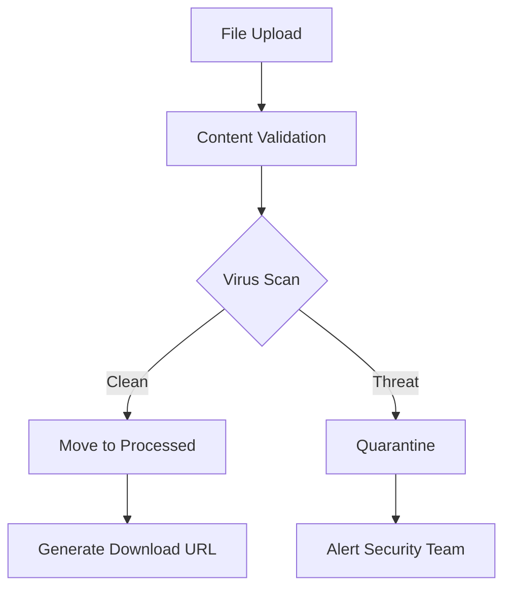

# 🏗️ CrapGPT Deployment Architecture
## Production-Ready Local/Remote Execution Model

This document details the complete deployment architecture that follows security best practices for separating the VPS control plane from worker execution environments.

---

## 🎯 Architecture Overview

CrapGPT uses a **Control Plane + Worker** architecture that strictly separates what runs locally on your VPS versus what runs in isolated remote environments.

```
┌─────────────────┐    ┌──────────────────┐    ┌─────────────────┐
│   VPS Control   │    │  Worker Queues   │    │ Remote Workers  │
│     Plane       │◄──►│    (Redis)       │◄──►│  (Containers)   │
│                 │    │                  │    │                 │
│ • Auth          │    │ • Job Routing    │    │ • LLM Inference │
│ • Routing       │    │ • Priority       │    │ • Media Gen     │
│ • Database      │    │ • Monitoring     │    │ • Security Scan │
│ • Presigned URLs│    │ • Retry Logic    │    │ • File Process  │
└─────────────────┘    └──────────────────┘    └─────────────────┘
```

---

## 🏛️ Control Plane (VPS)

### What Runs Locally
**ONLY** lightweight, safe operations run on your main VPS:

#### ✅ Allowed Operations
- **Authentication & Authorization**
- **Session Management** 
- **API Routing & Rate Limiting**
- **Database Queries** (read/write)
- **Presigned URL Generation**
- **JSON Validation** (small payloads)
- **Markdown Conversion** (< 10KB)
- **Webhook Receivers** (immediate 200 response)

#### 🚫 Never Allowed Operations
- **LLM Inference** (requires GPU/heavy CPU)
- **Image/Video Generation** (GPU intensive)
- **File Processing** (untrusted input)
- **Code Execution** (security risk)
- **Network Scanning** (security risk)
- **Shell Commands** (security risk)

### Security Boundaries

#### Resource Limits
```javascript
controlPlane: {
  maxMemoryUsage: '256MB',
  maxCPUUsage: '50%', 
  maxExecutionTime: 5000, // 5 seconds
  maxInputSize: 10240     // 10KB
}
```

#### Network Access
```javascript
allowedDestinations: [
  'database-server',
  'redis-server',
  'auth.google.com',
  'api.openrouter.ai'  // API calls only
]

blockedDestinations: [
  'internal-networks',
  'cloud-metadata',
  'localhost-services'
]
```

#### Input Filtering
```javascript
blockedPatterns: [
  /\b(exec|eval|system|shell)\b/i,     // No code execution
  /\b(rm|del|format|sudo)\b/i,         // No system commands  
  /<script[^>]*>/i,                    // No embedded scripts
  /[;&|`]/                             // No shell operators
]
```

---

## 🏭 Worker Execution Environment

### Worker Types

#### 1. Standard Workers
**Purpose**: LLM inference, text processing
```yaml
resources:
  memory: 2GB
  cpu: 1 core
  timeout: 300s
security:
  sandbox: container
  networkAccess: [api-endpoints]
  readOnlyRoot: false
  seccomp: default
```

#### 2. Isolated Workers  
**Purpose**: Risky operations (file processing, code execution)
```yaml
resources:
  memory: 1GB
  cpu: 0.5 core
  timeout: 120s
security:
  sandbox: strict
  networkAccess: []      # NO network access
  readOnlyRoot: true
  seccomp: strict
  capabilities: []       # Minimal privileges
```

#### 3. GPU Workers
**Purpose**: Media generation (images, video, audio)
```yaml
resources:
  memory: 8GB
  cpu: 2 cores
  gpu: 1 unit
  timeout: 600s
security:
  sandbox: container
  networkAccess: [model-apis]
  volumes: [models:ro, output:rw]
```

### Container Security

#### Base Configuration
```dockerfile
# Use minimal base images
FROM scratch
# or
FROM distroless/base

# Run as non-root user
USER 10001:10001

# Read-only root filesystem
--read-only
--tmpfs /tmp

# Minimal capabilities
--cap-drop=ALL
--cap-add=CHOWN  # Only if needed

# SecComp profile
--security-opt seccomp=strict.json

# AppArmor profile  
--security-opt apparmor=crapgpt-worker
```

#### Network Isolation
```bash
# No inbound connections
--publish-all=false

# Restricted outbound (by worker type)
# Standard: API endpoints only
# Isolated: NO network access
# GPU: Model download endpoints only
```

---

## 📋 Decision Matrix

### Local vs Remote Routing

| Operation Type | Runs Local | Runs Remote | Reason |
|---------------|------------|-------------|---------|
| **Authentication** | ✅ Yes | ❌ No | Needs first-party secrets |
| **Database Queries** | ✅ Yes | ❌ No | Direct DB access required |
| **JSON Validation** | ✅ Yes | ❌ No | Light, deterministic, safe |
| **Presigned URLs** | ✅ Yes | ❌ No | Needs AWS/R2 credentials |
| **LLM Inference** | ❌ No | ✅ Yes | Requires GPU/heavy CPU |
| **Image Generation** | ❌ No | ✅ Yes | GPU intensive |
| **File Processing** | ❌ No | ✅ Yes | Untrusted input |
| **Security Scanning** | ❌ No | ✅ Yes | Risky syscalls |
| **Code Execution** | ❌ No | ✅ Yes | Security risk |

### Automatic Decision Logic

The system automatically routes operations based on:

```javascript
// Force remote if ANY condition is true:
forceRemote = [
  requiresGPU(operation),
  isHeavyCPU(operation), 
  hasUntrustedInput(input),
  hasRiskySyscalls(operation),
  hasReliableAPI(operation)
].some(condition => condition)

// Allow local only if ALL conditions are true:
allowLocal = [
  isLight(operation),
  isDeterministic(operation),
  isLowMemory(operation),
  needsFirstPartySecrets(operation),
  isLatencyCritical(operation),
  isSafeToExecute(operation)
].every(condition => condition)
```

---

## 📁 File Handling Strategy

### Presigned URLs (No VPS Transit)

Files **never** route through your VPS. Instead:

#### Upload Flow
1. Client requests upload URL from VPS
2. VPS generates presigned POST URL (S3/R2)
3. Client uploads directly to cloud storage
4. Worker processes file in isolation
5. Results stored back to cloud storage

#### Download Flow  
1. Client requests download URL from VPS
2. VPS validates permissions & generates presigned GET URL
3. Client downloads directly from cloud storage

### Security Validation

#### Upload Validation
```javascript
validation: [
  'file-extension-whitelist',
  'content-type-verification', 
  'filename-sanitization',
  'size-limits',
  'virus-scanning',
  'content-inspection'
]
```

#### Processing Pipeline


---

## 🔐 Security Model

### Secrets Management

#### Control Plane Secrets
```bash
# Only essential secrets on VPS
DATABASE_URL=postgresql://...
JWT_SECRET=...
GOOGLE_CLIENT_ID=...
GITHUB_CLIENT_SECRET=...
REDIS_URL=...
```

#### Worker Secrets
```bash
# Injected at runtime, scoped per operation
OPENROUTER_API_KEY=...    # Only for LLM workers
FAL_API_KEY=...          # Only for media workers  
HEXSTRIKE_KEY=...        # Only for fast inference
```

### Network Security

#### VPS Firewall Rules
```bash
# Inbound: Only HTTPS
iptables -A INPUT -p tcp --dport 443 -j ACCEPT
iptables -A INPUT -p tcp --dport 80 -j REDIRECT --to-port 443

# Outbound: Database, Redis, APIs only
iptables -A OUTPUT -d database-ip -j ACCEPT
iptables -A OUTPUT -d redis-ip -j ACCEPT
iptables -A OUTPUT -d 0.0.0.0/0 -p tcp --dport 443 -j ACCEPT
```

#### Worker Network Policies
```yaml
# Kubernetes NetworkPolicy example
apiVersion: networking.k8s.io/v1
kind: NetworkPolicy
metadata:
  name: worker-isolation
spec:
  podSelector:
    matchLabels:
      role: worker
  policyTypes:
  - Ingress
  - Egress
  ingress: []  # No inbound connections
  egress:
  - to: []     # Configured per worker type
```

---

## 🚀 Deployment Options

### Option 1: Docker + Docker Compose

**Best for**: Small to medium deployments

```yaml
# docker-compose.yml
version: '3.8'
services:
  crapgpt-control-plane:
    build: .
    ports:
      - "443:3001"
    environment:
      - NODE_ENV=production
    depends_on:
      - postgres
      - redis

  worker-standard:
    image: crapgpt/standard-worker
    deploy:
      replicas: 3
    environment:
      - WORKER_TYPE=standard

  worker-isolated:
    image: crapgpt/isolated-worker
    deploy:
      replicas: 2
    security_opt:
      - seccomp:strict.json
      - apparmor:confined
    read_only: true
```

### Option 2: Kubernetes

**Best for**: Large scale, enterprise deployments

```yaml
# k8s/control-plane.yaml
apiVersion: apps/v1
kind: Deployment
metadata:
  name: crapgpt-control-plane
spec:
  replicas: 3
  selector:
    matchLabels:
      app: crapgpt-control-plane
  template:
    spec:
      containers:
      - name: crapgpt
        image: crapgpt/control-plane:latest
        resources:
          limits:
            memory: "256Mi"
            cpu: "500m"
        securityContext:
          runAsNonRoot: true
          readOnlyRootFilesystem: true
```

### Option 3: Serverless + Container Jobs

**Best for**: Variable load, cost optimization

```yaml
# Control plane on serverless (Vercel, Netlify, etc.)
# Workers on:
# - AWS Fargate
# - Google Cloud Run Jobs  
# - Azure Container Instances
```

---

## 📊 Monitoring & Observability

### Key Metrics

#### Control Plane
```javascript
metrics: [
  'request_rate',
  'response_time', 
  'error_rate',
  'memory_usage',
  'cpu_usage',
  'database_connections'
]
```

#### Workers
```javascript
metrics: [
  'job_queue_length',
  'job_processing_time',
  'job_success_rate', 
  'worker_utilization',
  'container_restarts',
  'security_violations'
]
```

### Alerting Rules

```yaml
alerts:
  - name: HighMemoryUsage
    condition: memory_usage > 80%
    severity: warning
    
  - name: SecurityViolation
    condition: blocked_operation_count > 0
    severity: critical
    
  - name: JobQueueBacklog  
    condition: queue_length > 100
    severity: warning
```

---

## 🔧 Configuration Examples

### Environment Variables

```bash
# .env.production
# Control Plane Configuration
NODE_ENV=production
LOG_LEVEL=info
MAX_CONCURRENT_REQUESTS=1000
ORCHESTRATION_MODE=enabled

# Security
CORS_ORIGIN=https://yourdomain.com
API_SECURITY_ENABLED=true
RATE_LIMIT_MAX_REQUESTS=1000

# Worker Configuration  
WORKER_CONCURRENCY=5
WORKER_TIMEOUT=300000
REDIS_URL=redis://redis-cluster:6379

# File Storage (Presigned URLs)
AWS_REGION=us-east-1
S3_BUCKET=crapgpt-files
# OR for Cloudflare R2:
R2_ENDPOINT=https://your-account.r2.cloudflarestorage.com
R2_BUCKET=crapgpt-files
```

### Infrastructure as Code

#### Terraform Example
```hcl
# terraform/main.tf
resource "aws_ecs_cluster" "crapgpt_workers" {
  name = "crapgpt-workers"
  
  setting {
    name  = "containerInsights"
    value = "enabled"
  }
}

resource "aws_ecs_task_definition" "isolated_worker" {
  family = "crapgpt-isolated-worker"
  
  container_definitions = jsonencode([
    {
      name      = "worker"
      image     = "crapgpt/isolated-worker:latest"
      memory    = 1024
      cpu       = 512
      essential = true
      
      linuxParameters = {
        capabilities = {
          drop = ["ALL"]
        }
        readonlyRootFilesystem = true
      }
    }
  ])
}
```

---

## 🚨 Security Checklist

### Pre-Deployment
- [ ] All secrets are properly scoped 
- [ ] Network policies are configured
- [ ] Container security profiles are applied
- [ ] File upload validation is enabled
- [ ] Rate limiting is configured
- [ ] Monitoring is set up

### Post-Deployment
- [ ] Security scanning is working
- [ ] Worker isolation is verified
- [ ] Job queues are processing
- [ ] Presigned URLs are working
- [ ] Error handling is operational
- [ ] Backup/recovery procedures are tested

### Ongoing Maintenance
- [ ] Regular security updates
- [ ] Log analysis and alerting
- [ ] Performance optimization
- [ ] Capacity planning
- [ ] Disaster recovery testing

---

## 🔗 Related Documentation

- [MEGA_SETUP.md](./MEGA_SETUP.md) - Complete setup instructions
- [agents.md](./agents.md) - Agent configuration details
- [INTEGRATION_COMPLETE.md](./INTEGRATION_COMPLETE.md) - Integration summary

---

**This architecture ensures maximum security while maintaining the full power of CrapGPT's AI orchestration capabilities. The strict control plane/worker separation means you can confidently process untrusted inputs, execute risky operations, and scale infinitely - all while keeping your core VPS secure.**