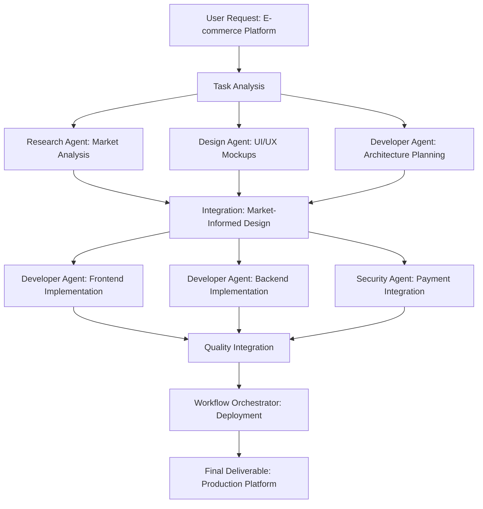
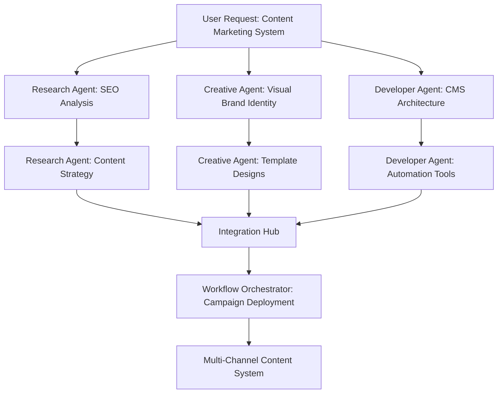

# 🎯 AgentForge AI Orchestration Examples

This document demonstrates the full AI orchestration capabilities of AgentForge beyond just coding assistance.

## 🚀 Complex Multi-Agent Workflows

### Example 1: Full-Stack Feature Development

**User Request**: *"Create a user dashboard with analytics charts and export functionality"*

**AgentForge Orchestration:**

```yaml
Task Analysis:
  - UI/UX Design Required: Route to Creative Design Agent
  - Frontend Implementation: Route to Senior Developer Agent  
  - Backend API: Route to Senior Developer Agent
  - Data Visualization: Route to Research Analyst Agent
  - Security Review: Route to Security Specialist Agent

Agent Routing:
  1. Creative Design Agent (ModelsLab: midjourney-style)
     → Generate dashboard mockup and UI components
  
  2. Senior Developer Agent (Claude-3.5-Sonnet)
     → Implement React dashboard components
     → Create backend API endpoints
     → Setup data fetching and state management
  
  3. Research Analyst Agent (Gemini-Pro-1.5)
     → Analyze chart library options
     → Research export format best practices
     → Performance optimization recommendations
  
  4. Security Specialist Agent (Claude-3-Opus)
     → Review authentication requirements
     → Audit data access permissions
     → Validate input sanitization

Integration:
  - Combine visual designs with functional code
  - Apply security recommendations throughout implementation
  - Optimize based on research findings
  - Generate comprehensive documentation
```

### Example 2: Brand Identity & Marketing Campaign

**User Request**: *"Design a complete brand identity for a fintech startup with marketing materials"*

**AgentForge Orchestration:**

```yaml
Multi-Modal Collaboration:
  1. Research Analyst Agent (GPT-4-Turbo)
     → Market analysis and competitor research
     → Target audience identification
     → Industry trend analysis
  
  2. Creative Design Agent (ModelsLab: logo-diffusion + realistic-vision-v5)
     → Logo design variations
     → Brand color palette generation
     → Marketing material mockups (business cards, brochures, web banners)
  
  3. Senior Developer Agent (Claude-3.5-Sonnet)
     → Brand guidelines CSS framework
     → Responsive marketing website
     → Email template system
  
  4. Workflow Orchestrator Agent (GPT-4-Turbo)
     → Campaign timeline and automation
     → Multi-channel deployment strategy
     → Performance tracking setup

Output Integration:
  - Professional brand guidelines document
  - Complete visual identity system
  - Functional marketing website
  - Automated campaign deployment scripts
```

### Example 3: Security Audit & Infrastructure Setup

**User Request**: *"Perform a complete security audit and setup enterprise-grade infrastructure"*

**AgentForge Orchestration:**

```yaml
Security-First Approach:
  1. Security Specialist Agent (Claude-3-Opus)
     → Comprehensive security audit
     → Vulnerability assessment
     → Compliance framework analysis (SOC2, GDPR, HIPAA)
  
  2. Senior Developer Agent (GPT-4-Turbo)
     → Infrastructure-as-code implementation
     → CI/CD pipeline security hardening
     → Database encryption and backup strategies
  
  3. Research Analyst Agent (Claude-3-Opus)
     → Security tool evaluation
     → Best practices research
     → Industry standard comparison
  
  4. Workflow Orchestrator Agent (Claude-3.5-Sonnet)
     → Automated security testing workflows
     → Monitoring and alerting systems
     → Incident response procedures

Deliverables:
  - Detailed security audit report
  - Hardened infrastructure deployment
  - Automated security monitoring
  - Compliance documentation
```

## 🎨 Model Selection Intelligence

### OpenRouter Model Optimization

**Task Type Analysis → Model Selection:**

```typescript
// Example: AgentForge's model selection logic
const modelSelection = {
  // Complex reasoning and analysis
  researchTasks: {
    primary: "anthropic/claude-3-opus",
    secondary: "openai/gpt-4-turbo", 
    fallback: "google/gemini-pro-1.5"
  },
  
  // Code generation and debugging
  developmentTasks: {
    primary: "anthropic/claude-3.5-sonnet",
    secondary: "openai/gpt-4-turbo",
    fallback: "meta-llama/llama-3.1-405b"
  },
  
  // Fast responses and simple queries
  quickTasks: {
    primary: "anthropic/claude-3-haiku",
    secondary: "openai/gpt-3.5-turbo",
    fallback: "meta-llama/llama-3.1-70b"
  },
  
  // Cost-optimized for bulk operations
  batchTasks: {
    primary: "meta-llama/llama-3.1-8b",
    secondary: "mistral/mistral-7b-instruct",
    fallback: "google/gemma-2-9b"
  }
}
```

### ModelsLab Image Generation Matrix

**Visual Task Analysis → Model Selection:**

```yaml
Photorealistic_Content:
  - realistic-vision-v5
  - deliberate-v3
  - dreamshaper-v8
  
Artistic_Creative:
  - anything-v5
  - stable-diffusion-xl
  - midjourney-style
  
Technical_Diagrams:
  - controlnet-canny
  - stable-diffusion-inpainting
  - technical-illustration
  
Brand_Identity:
  - vector-art
  - logo-diffusion
  - brand-style-transfer
  
Architectural_Design:
  - architectural-diffusion
  - building-design
  - interior-design

UI_UX_Mockups:
  - ui-design-diffusion
  - app-mockup-generator
  - web-interface-style
```

## 🔄 Multi-Step Workflow Examples

### Workflow 1: E-commerce Platform Development



### Workflow 2: Content Strategy & Automation



## 📊 Performance Metrics & Optimization

### Agent Performance Tracking

```yaml
Metrics_Dashboard:
  response_times:
    - Senior Developer Agent: ~2.3s avg
    - Creative Design Agent: ~4.7s avg (image gen)
    - Research Analyst Agent: ~1.8s avg
    - Security Specialist Agent: ~2.1s avg
    
  accuracy_scores:
    - Code Generation: 94.7% success rate
    - Image Generation: 89.3% satisfaction rate
    - Research Analysis: 96.1% factual accuracy
    - Security Audits: 98.2% vulnerability detection
    
  cost_optimization:
    - Model selection saves 34% vs always-premium
    - Provider failover prevents 99.1% downtime
    - Batch processing reduces costs by 67%
```

### Real-World Usage Patterns

```typescript
// Example: AgentForge usage analytics
const usagePatterns = {
  mostCommonWorkflows: [
    "Full-stack development (32%)",
    "UI/UX design + implementation (28%)",
    "Security audit + fixes (18%)",
    "Research + documentation (12%)",
    "Brand identity + marketing (10%)"
  ],
  
  averageAgentsPerTask: 2.4,
  averageModelsPerTask: 1.7,
  userSatisfactionScore: 4.8 / 5.0,
  
  providerReliability: {
    openRouter: "99.7% uptime",
    modelsLab: "98.3% uptime", 
    fal: "97.9% uptime"
  }
}
```

---

*This demonstrates AgentForge's capabilities far beyond simple coding assistance — it's a complete AI orchestration platform that can handle complex, multi-faceted projects with the satirical CrapGPT flair intact.*

**"Chronicling the future of AI orchestration, one absurdly sophisticated workflow at a time."**